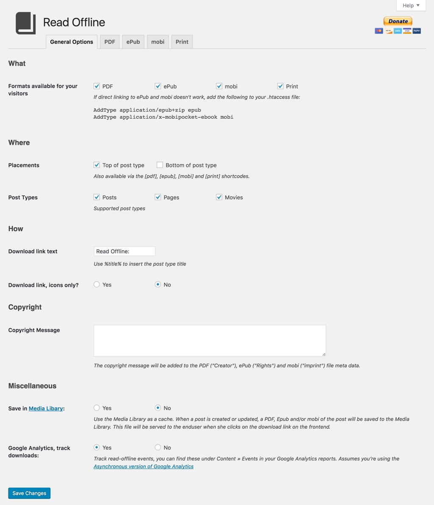
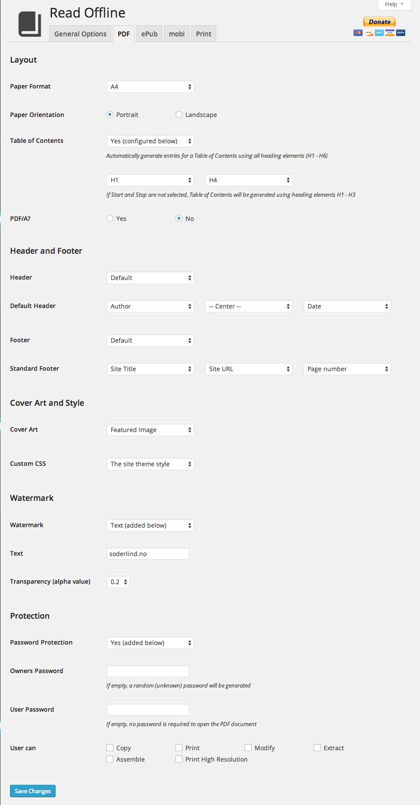
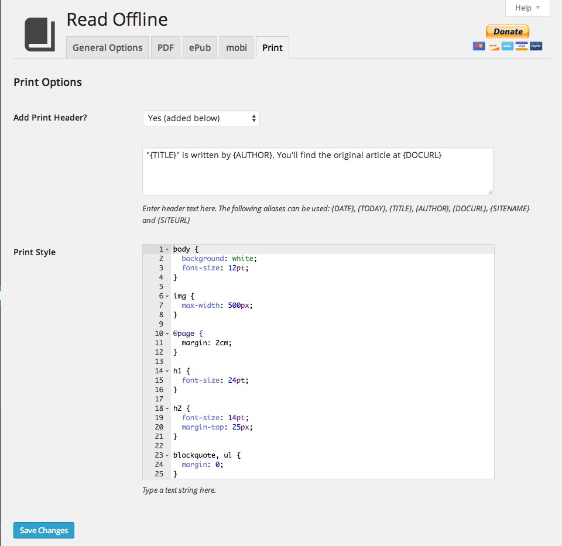

 
# Read Offline #

Read Offline allows you to download or print posts and pages. You can download the post as PDF, ePub or mobi

## Demo examples ##

Based on the [UTF-8 sampler from the Kermit project](http://www.columbia.edu/kermit/utf8.html):
* [PDF](https://github.com/soderlind/read-offline-fonts/raw/master/examples/internationalizaetion.pdf)
	* Cover art
	* Table of Contents
	* Header and footer
	* Watermark
	* Protected, only print enabled
* [ePub](https://github.com/soderlind/read-offline-fonts/raw/master/examples/internationalizaetion.epub)
	* Cover art
	* Table of Contents
* [mobi](https://github.com/soderlind/read-offline-fonts/raw/master/examples/internationa.mobi)
	* Cover Art
	* Table of Contents

For full PDF font support, you must add the [Read Offline Fonts](https://github.com/soderlind/read-offline-fonts) add-on plugin.

## Features ##

*   Add download links to the top and bottom of a post or page (configurable in Read Offline->General Options)
*   You can download a PDF, ePub or mobi file containing the current post or page, or you can print the post / page.
*   The download filename is based on the posts slug (`$post->post_name`)
*   Adds meta data to the file
	*   Title, Author, Date, Copyright message etc.
* PDF features (set in Read Offline->PDF)
	* Paper formats (A0 - A10, B0 - B10, C0 - C10, 4A0, 2A0, RA0 - RA4, SRA0 - SRA4, Letter, Legal, Executive, Folio, Demy and Royal)
	* Table of Contents
	* Cover Page
	* Header and Footer
	* Theme or Custom CSS
	* Watermark
	* Protection
* ePub (set in Read Offline->ePub)
	* Table of Contents
	* Cover Page (static or per post feature image)
	* Custom CSS
* mobi (set in Read Offline->mobi)
	* Table of Contents
	* Cover Page
* Print features (set in Read Offline->print)
   * Add print header text
   * Custom print style
* Permalink support (/read-offline/"postid"/"post-name"."type"). I've written a "[how-to add a permalink to your plugin](http://soderlind.no/archives/2012/11/01/wordpress-plugins-and-permalinks-how-to-use-pretty-links-in-your-plugin/)" guide at soderlind.no
* Google Analytics read-offline event tracking. You can find these under Content » Events in your Google Analytics reports. Assumes you’re using the [Asynchronous version of Google Analytics](http://code.google.com/apis/analytics/docs/tracking/asyncTracking.html)
* languages/read-offline.po for easy translation.
* Support for all mPDF fonts via the [Read Offline Fonts](https://github.com/soderlind/read-offline-fonts) add-on plugin

## Feedback & Support ##

If you have any requests, issues, or other feedback to provide on this beta, please use the links below.

* [Report a problem](https://github.com/soderlind/read-offline/issues/new?title=Issue%3A&body=**Description%20of%20Problem**%0A%0A%0A%0A**Details**%0A%0A%0A%0A*%20URL%20of%20Page%20exhibiting%20problem%3A%20%0A*%20Browser(s)%20exhibiting%20problem%20(Firefox%2C%20Chrome%2C%20etc.)%3A%20%0A*%20Version%20of%20WordPress%20Installed%3A%20%0A*%20Other%20plugins%20installed%3A%20%0A%0A%0A**Screenshots**%0A%0A)
* [Request a feature](https://github.com/soderlind/read-offline/issues/new?title=Request%3A&body=**Description%20of%20feature%2Frequest**%0A%0A%0A%0A**This%20feature%20would%20be%20used%20to**%0A%0A)
* [Provide general feedback](https://github.com/soderlind/read-offline/issues/new?title=Feedback%3A%20&body=)

## Todo ##

Issues tagged [enhancement](https://github.com/soderlind/read-offline/labels/enhancement) are planed enhancements.

## Changelog ##

Please [see the CHANGELOG.md](CHANGELOG.md) file.

## Installation ##

1. Download the plugin and extract the read-offline.zip
1. Upload the extracted `read-offline` folder to the `/wp-content/plugins/` directory
1. Activate the plugin through the 'Plugins' menu in WordPress

## Use ##

Add it to the top or bottom of each post and/or page (See Settings->Read Offline)

([shortcode](https://github.com/soderlind/read-offline/issues/6) and [widget](https://github.com/soderlind/read-offline/issues/10) comming soon)

## Screenshots ##

###1. Read Offline -> General Options###

###2. Read Offline -> PDF###

###3. Read Offline -> Print###

## Developer Notes

* Latest Stable Release: [0.7.2](https://github.com/soderlind/read-offline/releases/tag/0.7.2)
* Stable Branch: [master](https://github.com/soderlind/read-offline/tree/master)

~Current Version: 0.7.2~

## Credits ##

Please see [CREDITS.md](CREDITS.md)
