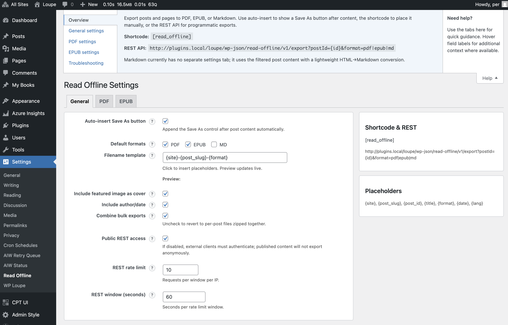

# 📚 Read Offline - Transform Your WordPress Content

**Turn any WordPress post or page into beautiful, portable documents in seconds.**

Create professional **PDF**, **EPUB**, and **Markdown** files from your WordPress content with one click. Perfect for bloggers, content creators, businesses, and anyone who wants to share their content offline or across different platforms.

✨ **Lightning fast** • 🔒 **Privacy-first** • 🎨 **Beautifully formatted** • 🔧 **Developer-friendly**

## 🚀 Why Choose Read Offline?

### 📄 **Professional PDF Export**
- **Beautiful table of contents** with automatic page numbers
- **Custom branding** with headers, footers, and watermarks
- **Responsive layouts** that look great on any device
- **Multi-post exports** - combine articles into comprehensive guides

### 📖 **Publishing-Ready EPUB**
- **Industry-standard format** compatible with all e-readers
- **Custom cover images** and professional metadata
- **Multiple styling options** - light, dark, or completely custom
- **Validation tools** to ensure perfect compatibility

### ⚡ **Lightning-Fast Performance**
- **Smart caching** - exports are generated once, served instantly
- **Bulk operations** - export dozens of posts at once
- **Background processing** - no waiting around for large exports

### 🔒 **Privacy & Security First**
- **No tracking or telemetry** - your content stays private
- **Local processing** - files generated on your server
- **Rate limiting** to prevent abuse
- **Secure access controls** with optional public sharing

## 🎯 Perfect For

- **📝 Bloggers** - Share your posts as professional PDFs or e-books
- **🏢 Businesses** - Create branded reports and documentation
- **👩‍🏫 Educators** - Distribute course materials and reading lists
- **📚 Authors** - Convert blog series into publishable e-books
- **💼 Agencies** - Deliver client reports in multiple formats
- **🔧 Developers** - Export content for static sites or migration

## ⚡ Quick Start (3 Simple Steps)

### 1. **Install & Activate**

- **Quick Install**

   - Download [`read-offline.zip`](https://github.com/soderlind/read-offline/releases/latest/download/read-offline.zip)
   - Upload via  Plugins > Add New > Upload Plugin
   - Activate the plugin.

- **Updates**
   * Plugin [updates are handled automatically](https://github.com/soderlind/wordpress-plugin-github-updater#readme) via GitHub. No need to manually download and install updates.

### 2. **Configure Your Preferences**
Visit *Settings → Read Offline* to choose your default formats and customize appearance.

### 3. **Start Exporting**
Add the export button to any post automatically, or use the `[read_offline]` shortcode anywhere.

## 🛠️ Advanced Features

### 📦 **Bulk Export Magic**
Select multiple posts and pages from your admin area and export them as:
- **Single combined document** - Perfect for creating comprehensive guides
- **ZIP archive** - Individual files for easy distribution  
- **Custom filename patterns** - Organize your exports automatically

### 🎨 **Customization Options**
- **PDF Styling**: Custom margins, headers, footers, and watermarks
- **EPUB Themes**: Light, dark, or completely custom CSS
- **Brand Integration**: Add your logo and company information
- **Table of Contents**: Automatic generation with smart formatting

### 🔌 **Developer Friendly**
- **REST API** for programmatic access: `GET /wp-json/read-offline/v1/export`
- **50+ hooks and filters** for complete customization ([see HOOKS.md](HOOKS.md))
- **Smart caching** for optimal performance
- **Markdown export** for static site generators

*For developers: Run `composer install` to update vendors or access testing tools.*

## 💻 System Requirements

- ✅ **WordPress 6.5+**
- ✅ **PHP 8.2+** 
- ✅ **Zip extension** (for bulk exports)
- ✅ **Tested up to WordPress 6.8**

*All required libraries are bundled - no additional setup needed!*

## ❓ Common Questions

| **Question** | **Answer** |
|--------------|------------|
| **How do I add the export button to my posts?** | Go to *Settings → Read Offline* and enable auto-insertion, or use the `[read_offline]` shortcode anywhere. |
| **Can I customize the PDF styling?** | Yes! Adjust margins, headers, footers, fonts, and colors in the PDF settings section. |
| **Are exports cached for performance?** | Absolutely! Files are cached until content or settings change, ensuring lightning-fast repeat downloads. |
| **Can visitors download without logging in?** | Only if you enable public REST access in settings. By default, only logged-in users can export. |
| **How do I export multiple posts at once?** | Select posts in your admin area, choose a "Read Offline" bulk action, and apply. |

## 🛡️ Privacy & Security

- **🔒 Zero telemetry** - Your content never leaves your server
- **🚫 No external dependencies** - All processing happens locally
- **⚡ Rate limiting** - Built-in protection against abuse
- **🔐 Access controls** - Public downloads disabled by default

## 📋 What's New in 2.x

- ✨ **Improved PDF TOCs** with hierarchical structure and page numbers
- 🔒 **Enhanced security** with nonce-based access for non-public mode  
- 📊 **Integrity headers** for download verification (Content-Length, checksums)
- 🔧 **EPUB validation** with external epubcheck integration support
- 📱 **Responsive admin UI** with better mobile experience

## 🆘 Need Help?

**Quick Fixes:**
- **Missing export buttons?** Check if formats are enabled in Settings → Read Offline
- **PDF missing page numbers?** Enable page numbering in PDF settings
- **Getting ZIP instead of combined file?** Make sure "Combine bulk exports" is turned on
- **Stale content in exports?** Use the "Clear Cache" button in settings

**Still stuck?** Check out the detailed [HOOKS.md](HOOKS.md) for developer documentation or open an issue on GitHub.

## 📄 License & Credits

- **License:** GPLv2 or later
- **PDF Engine:** Powered by mPDF
- **EPUB Engine:** Powered by PHPePub

---

**Ready to transform your WordPress content?** Install Read Offline today and start creating beautiful documents in seconds.

*For complete technical details, see [`readme.txt`](readme.txt), [`CHANGELOG.md`](CHANGELOG.md), and [`HOOKS.md`](HOOKS.md).*
